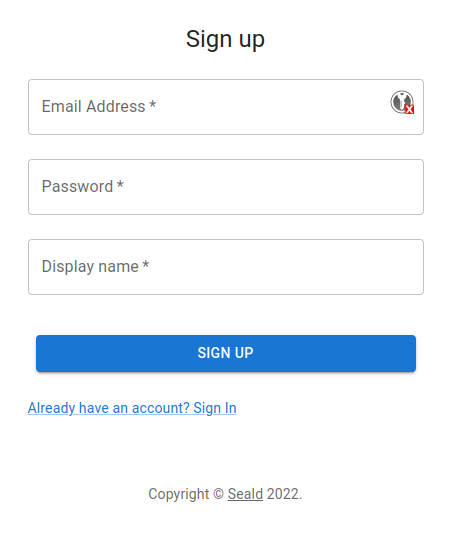

# Using `Pubnub.com` and `Seald.io` to build an end-to-end encrypted chat

PubNub is a real-time communication service that can be integrated into most applications. Reliable and scalable, it can 
easily be integrated with most common frameworks.

Seald.io offers an SDK that allows you to do end-to-end encryption, with advanced management features, without any prior
cryptographic knowledge. This SDK can be integrated into web, backend, mobile, or desktop applications.


## Why use end-to-end encryption?

End-to-end encryption offers the highest level of privacy and security. It allows encrypting sensitive data as soon as 
they are collected. An early encryption will reduce the attack surface of your app.
Another advantage is that you can precisely manage who can access the data. This will also protect when it is not in 
your scope, like third party services.
End-to-end encryption allows you to keep control at all times, when your data is in transit, when it is at rest, even 
when it is not in your hand. Thus, it offers a fare wider protection than other encryption technologies (TLS,
full-disk-encryption, ...).


Whenever you face a case where compliance is important (GDPR, HIPAA, SOC-2,...) or where you have sensitive data
(medical, defense,...), end-to-end encryption is a must-have.
But even for more commonplace data, it's good practice to have. A data breach is a devastating event that is becoming
more and more frequent.


## Why use Seald.io instead of PubNub encryption hook

PubNub SDK offers a simple encryption hook, using the `cipherKey` argument when instantiating its SDK. Doing so will
ensure that all uploaded messages are encrypted before being sent. However, you have to do the key management yourself,
which is the hardest part of an end-to-end encrypted system.

Vulnerabilities rarely come from the encryption itself, but most often from keys being leaked through flaws in the
security model.

Using a third-party service for your security allows you to not have a single point of failure. Seald.io proposes a
robust security model, certified by the ANSSI, with real-time access-management control, user revocation and recovery,
2FA, and more.


## Goals

This article explains how to integrate Seald with PubNub step-by-step, in order to secure your chat with the best
end-to-end encryption. We will build an example messaging app, with the following features:

 - One-to-one and group chat rooms.
 - Each member has a dedicated chat room with every other user.
 - Anyone can create a group chat room with multiple other users.
 - Use end-to-end encryption for every message and file sent.
 - Allow real-time access-management to chats.


## Implementation

### Set up a PubNub account

To get started, you will need a PubNub account. You can sign up [here](https://admin.pubnub.com/#/login). Once logged in
on your dashboard, you should see that a demo app with a demo keyset has been created.


Select the demo keyset, and scroll to the configuration tab. For our demo, we need to activate `Files` and `Objects`
permissions. For the `Object` permission, we will use the following events: `User Metadata Events`, `Channel Metadata
Events` and`Membership Events`.

Once the keyset is created and configured, we need to copy it to our frontend.

Let's create a JSON file on the `src/` folder, called `settings.json`. We will use this file for all the API keys we will need. Starting with the PubNub keyset:

```json
{
  "PUBNUB_PUB_KEY": "pub-c-XXXXXXXX-XXXX-XXXX-XXXX-XXXXXXXXXXXX",
  "PUBNUB_SUB_KEY": "sub-c-XXXXXXXX-XXXX-XXXX-XXXX-XXXXXXXXXXXX"
}
```

### Building a basic chat using PubNub

We will use PubNub for almost every backend task. Our backend will only handle user sign-up/sign-in, and use a
minimalist user model with only an ID, a name, and an email.

On the front side, we need a small authentication interface.


Once the user has an account, the first thing they need is an instance of the PubNub SDK. 

To identify the user on Pubnub, we need to provide a UUID. To keep things simple, we will use the same id as on our
backend.

```js
/* frontend/src/App.js */

import settings from './settings.json' // our settings file for API keys

/*
...
*/

const pubnub = new PubNub({
    publishKey: settings.PUBNUB_PUB_KEY,
    subscribeKey: settings.PUBNUB_SUB_KEY,
    uuid: currentUser.id
})
```

To keep our backend as simple as possible, we will use PubNub's user metadata to exchange users' info.
Just after the SDK instantiation, we simply call PubNub `setUUIDMetadata` function.

```js
/* frontend/src/App.js */

await pubnub.objects.setUUIDMetadata({
  uuid: currentUser.id,
  data: {
    email: currentUser.emailAddress,
    name: currentUser.name
  }
})
```

#### Getting initial app state

The first thing to do with PubNub is to retrieve all existing members and store them in our local data store.

```js
/* frontend/src/App.js */

const existingMembers = await pubnub.objects.getAllUUIDMetadata()
dispatch({
  type: SET_USERS,
  payload: {
    users: existingMembers.data.map(u => new User({ id: u.id, name: u.name, emailAddress: u.email }))
  }
})
```

Each chat room will correspond to a PubNub channel. We will also add some metadata to each channel:
- `ownerId`: The ID of the user who created the room.
- `one2one`: A boolean to differentiate direct messaging rooms, and group rooms.
- `archived`: A boolean, to hide a deleted group room.

The `ownerId` metadata will be used later, when adding the Seald SDK. PubNub doesn't have an ownership concept, but
Seald does. It will define who can add or remove users from a channel. It basically defines a group administrator.  

We will start by retrieving existing chat rooms. We will also need the room metadata, so we need to include custom
fields. Then, we need to filter out archived rooms, and send everything to our data store. Finally, we `subscribe` to
the PubNub channel associated with the room, so we will receive new messages.

```js
/* frontend/src/App.js */

// Retrieve rooms of which we are members
const memberships = await pubnub.objects.getMemberships({
  include: {
    customChannelFields: true
  }
})
const knownRooms = []
// For each room, retrieve room members
for (const room of memberships.data.filter(r => !r.channel.custom.archived)) {
  const roomMembers = await pubnub.objects.getChannelMembers({ channel: room.channel.id })
  knownRooms.push(new Room({
    id: room.channel.id,
    name: room.channel.name,
    users: roomMembers.data.map(u => u.uuid.id),
    ownerId: room.channel.custom.ownerId,
    one2one: room.channel.custom.one2one
  }))
}
// Store rooms in our data store
dispatch({
  type: SET_ROOMS,
  payload: {
    rooms: knownRooms
  }
})
// Subscribe to channels to get new messages
pubnub.subscribe({ channels: knownRooms.map(r => r.id) })
```

Now we have fetched all the rooms we are in. We need one last thing to finish app initialization: ensuring we have a
`one2one` room with every other member, including newly registered ones.

For every newly found user, we will create a new room and send a hello message. Then, we will set the room's metadata,
and subscribe to it.

```js
/* frontend/src/App.js */

// Ensure that we have a one2one room with everyone
const one2oneRooms = knownRooms.filter(r => r.one2one)
for (const m of existingMembers.data.filter(u => u.id!== currentUser.id)) {
    if (!one2oneRooms.find(r => r.users.includes(m.id))) {
      // New user found: generating a new one2one room
      const newRoomId = PubNub.generateUUID()
      const newRoom = new Room({
            id: newRoomId,
            users: [currentUser.id, m.id],
            one2one: true,
            name: m.name,
            ownerId: currentUser.id
          })
      // Add the new room to our local list
      dispatch({
        type: EDIT_OR_ADD_ROOM,
        payload: {
          room: new Room({
            id: newRoomId,
            users: [currentUser.id, m.id],
            one2one: true,
            name: m.name, ownerId: currentUser.id
          })
        }
      })
      // Publish a "Hello" message in the room
      await pubnub.publish({
        channel: newRoomId,
        message: {
          type: 'message',
          data: (await sealdSession.encryptMessage('Hello 👋'))
        }
      })
      // Subscribe to the new room
      pubnub.subscribe({ channels: [newRoomId] })
      await pubnub.objects.setChannelMetadata({
        channel: newRoomId,
        data: {
          name: 'one2one',
          custom: {
            one2one: true,
            ownerId: currentUser.id,
          },
        }
      })
      await pubnub.objects.setChannelMembers({
        channel: newRoomId,
        uuids: [currentUser.id, m.id]
      })
    }
}
```

Once all that is done, our initial app state is fully defined. However, we need to keep it up to date.
It can be done simply by adding an event listener for `membership` events.

```js
/* frontend/src/App.js */

pubnub.addListener({
  objects: async function(objectEvent) {
    if (objectEvent.message.type === 'membership') {
      if (objectEvent.message.event === 'delete') { // User is removed from a room
        /*
        Removing the room from store...
        */
      }
      if (objectEvent.message.event === 'set') { // User is added to a room
        const metadata = await pubnub.objects.getChannelMetadata({ channel: objectEvent.message.data.channel.id })
        const roomMembers = (await pubnub.objects.getChannelMembers({ channel: objectEvent.message.data.channel.id })).data.map(u => u.uuid.id)
        /*
        Adding new room to store + subscribing to new room channel...
        */
      }
    }
  }
})
pubnub.subscribe({ channels: [currentUser.id] }) // channel on which events concerning the current user are published
```

We can now have a look at a `one2one` chat room itself. Then we will handle group rooms.

#### Receiving and sending messages in a chat room

In a `chat.js` file, we will have all the logic to display the messages of a chat room.

To initialize this room, the only thing we need to do is to fetch all pre-existing messages. It can be done simply by
knowing the room ID.

```js
/* frontend/src/components/Chat.jsx */

const fetchedMessages = (await pubnub.fetchMessages({ channels: [currentRoomId] })).channels[currentRoomId]
```

We can subscribe to the channel to get new messages, and add a listener to display them in real-time.
```js
/* frontend/src/components/Chat.jsx */

pubnub.addListener({ message: handleReceiveMessage })
pubnub.subscribe({ channels: [currentRoomId] })
```

To send a message, we simply need to publish it on the channel:
```js
/* frontend/src/components/Chat.jsx */

const handleSubmitMessage = async e => {
  /* Some checks that the room is in a correct state... */
  await pubnub.publish({
    channel: state.room.id,
    message: {
      type: 'message',
      data: state.message
    }
  })
}
```

To send a file, we will first upload it to PubNub. Then we will get the uploaded file URI, and publish it as a message in the chat room.
```js
/* frontend/src/components/UploadButton.jsx */

// Upload Encrypted file
const uploadData = await pubnub.sendFile({
  channel: room.id,
  file: myFile,
  storeInHistory: false
})
const fileURL = await pubnub.getFileUrl({ id: uploadData.id, name: uploadData.name, channel: room.id })
await pubnub.publish({
  channel: state.room.id,
  message: {
    type: 'file',
    url: fileURL,
    fileName: await sealdSession.encryptMessage(selectedFiles[0].name)
  }
})
```


#### Managing group chat

To create and manage groups, we will need an interface for selecting users.


Once the group members have been selected, we can create a PubNub channel for our room, then set metadata and membership
for the channel. The code is very similar to what is done for one2one rooms, so we will not repeat it here.

We now have a full chat app. Let's add end-to-end encryption for every message!

### Adding end-to-end encryption with Seald

#### Set up a Seald account

To start with Seald, create a free trial account [here](https://www.seald.io/en/create-sdk)

When landing on the Seald dashboard, a few URLs and API tokens are displayed.
Get the following elements:
- appId
- apiURL
- keyStorageURL

We will add these keys to our `settings.json`

```json
{
  "PUBNUB_PUB_KEY": "pub-c-XXXXXXXX-XXXX-XXXX-XXXX-XXXXXXXXXXXX",
  "PUBNUB_SUB_KEY": "sub-c-XXXXXXXX-XXXX-XXXX-XXXX-XXXXXXXXXXXX",
  "SEALD_APP_ID": "XXXXXXXX-XXXX-XXXX-XXXX-XXXXXXXXXXXX",
  "SEALD_API_URL": "https://api.staging-0.seald.io",
  "SEALD_KEYSTORAGE_URL": "https://ssks.staging-0.seald.io"
}
```

To be able to use the Seald SDK, every user needs a licence JWT when signing-up.
These JWT needs to be generated on the backend using a secret and a secret ID.

From the dashboard landing page, copy the JWT secret and its associated ID in `backend/settings.json`

```json
{
  "SEALD_JWT_SECRET_ID": "XXXXXXXX-XXXX-XXXX-XXXX-XXXXXXXXXXXX",
  "SEALD_JWT_SECRET": "XXXXXXXXXXXXXXXXXXXXXXXX"
}
```

During the signup API call, we will generate a Seald licence JWT, and return it back.
```js
/* backend/routes/account.js */

const token = new SignJWT({
  iss: settings.SEALD_JWT_SECRET_ID,
  jti: uuidv4(), /// Random string with enough entropy to never repeat.
  iat: Math.floor(Date.now() / 1000), // JWT valid only for 10 minutes. `Date.now()` returns the  in milliseconds, this needs it in seconds.
  scopes: [3], // PERMISSION_JOIN_TEAM
  join_team: true
})
  .setProtectedHeader({ alg: 'HS256' })

const signupJWT = await token.sign(Buffer.from(settings.SEALD_JWT_SECRET, 'ascii'))
```

For more information about this, see
[our documentation article about JWT](https://docs.seald.io/en/sdk/guides/jwt.html#creating-a-json-web-token).

Then, we need to install the Seald SDK.

We also need to install a plugin to identify users on the Seald server. To do so, we will use the
`sdk-plugin-ssks-password` package.

This plugin allows for simple password authentication of our users.

```bash
npm i -S @seald-io/sdk @seald-io/sdk-plugin-ssks-password
```

#### Instantiating the Seald SDK

Then, we will create a `seald.js` file. In this file, we will start by creating a function to instantiate the Seald SDK.

```js
/* frontend/src/services/seald.js */

import SealdSDK from '@seald-io/sdk-web'
import SealdSDKPluginSSKSPassword from '@seald-io/sdk-plugin-ssks-password'
import settings from './settings.json'

let sealdSDKInstance = null

const instantiateSealdSDK = async () => {
  sealdSDKInstance = SealdSDK({
    appId: settings.SEALD_APP_ID,
    apiURL: settings.SEALD_API_URL,
    plugins: [SealdSDKPluginSSKSPassword(settings.SEALD_KEYSTORAGE_URL)]
  })
}
```

#### Creating and retrieving Seald identities

In `seald.js`, we will also add two function: one to create an identity and one to retrieve one. To create an identity,
we also need the licence JWT returned at account creation.

```js
/* frontend/src/services/seald.js */

export const createIdentity = async ({ userId, password, signupJWT }) => {
  await instantiateSealdSDK()
  await sealdSDKInstance.initiateIdentity({ signupJWT })
  await sealdSDKInstance.ssksPassword.saveIdentity({ userId, password })
}

export const retrieveIdentity = async ({ userId, password }) => {
  await instantiateSealdSDK()
  await sealdSDKInstance.ssksPassword.retrieveIdentity({ userId, password })
}
```

During our signup and sign-in flows, we just need to call these functions after the user has logged in.
At this point, every time our user is connected, he has a working Seald SDK, ready to encrypt and decrypt! 

Warning: For proper security, the password should be pre-hashed before being sent to the authentication server. For more
details on this, please see [the paragraph about password authentication in our documentation](https://docs.seald.io/en/sdk/guides/4-identities.html#password-also-used-for-authentication).

#### Start encrypting and decrypting messages

Each chat room will be associated with an `encryptionSession` on the Seald SDK. 

Every time we create a chat room, we simply have to add one line to create the encryption session, then use it:

```js
/* frontend/src/App.js */

// Create a Seald session
const sealdSession = await getSealdSDKInstance().createEncryptionSession(
  { userIds: [currentUser.id, m.id] },
  { metadata: newRoomId }
)
// Publish a "Hello" message in the room
await pubnub.publish({
  channel: newRoomId,
  message: {
    type: 'message',
    data: (await sealdSession.encryptMessage('Hello 👋'))
  }
})
```

Note that our user is included by default as a recipient of the `encryptionSession`

When accessing a room, we need to get the corresponding `encryptionSession`. It can be retrieved from any encrypted
messages or file. Once we have it, we'll keep it in component reference.

Then we can simply use `session.encryptMessage`,`session.encryptFile`, `session.decryptMessage` and
`session.decryptFile` functions.

Let's start with the messages. To send a message:

```js
/* frontend/src/components/Chat.js */

const handleSubmitMessage = async m => {
  /* Some validation that we are in a valid room... */

  // if there is no encryption session set in cache yet, create one
  // (should never happen, as a "Hello" is sent on room creation)
  if (!sealdSessionRef.current) {
    sealdSessionRef.current = await getSealdSDKInstance().createEncryptionSession(
      { userIds: state.room.users },
      { metadata: state.room.id }
    )
  }
  // use the session to encrypt the message we are trying to send
  const encryptedMessage = await sealdSessionRef.current.encryptMessage(state.message)
  // publish the encrypted message to pubnub
  await pubnub.publish({
    channel: state.room.id,
    message: {
      type: 'message',
      data: encryptedMessage
    }
  })

  /* Some cleanup... */
}
```

And when we receive a message:

```js
/* frontend/src/components/Chat.js */

const decryptMessage = async m => {
  /* Filter out files... */
  let encryptedData = m.message.data

  if (!sealdSessionRef.current) { // no encryption session set in cache yet
    // we try to get it by parsing the current message
    sealdSessionRef.current = await getSealdSDKInstance().retrieveEncryptionSession({ encryptedMessage: encryptedData })
    // now that we have a session loaded, let's decrypt
  }
  const decryptedData = await sealdSessionRef.current.decryptMessage(encryptedData)
  // we have successfully decrypted the message
  return {
    ...m,
    uuid: m.uuid || m.publisher,
    value: decryptedData
  }
  /* Some error handling... */
}

/* Other stuff... */

const handleReceiveMessage = async m => {
  const decryptedMessage = await decryptMessage(m)
  setState(draft => {
    draft.messages = [...draft.messages, decryptedMessage]
  })
}
```

Also, we use this `decryptMessage` function to decrypt all messages already in the session when opening a room:

```js
/* frontend/src/components/Chat.js */

const fetchedMessages = (await pubnub.fetchMessages({ channels: [currentRoomId] })).channels[currentRoomId]
const clearMessages = fetchedMessages ? await Promise.all(fetchedMessages.map(decryptMessage)) : []
```

And now for files. To upload a file:

```js
/* frontend/src/components/UploadButton.js */

// Encrypt file
const encryptedBlob = await sealdSession.encryptFile(
  selectedFiles[0],
  selectedFiles[0].name,
  { fileSize: selectedFiles[0].size }
)
const encryptedFile = new File([encryptedBlob], selectedFiles[0].name)
// Upload Encrypted file
const uploadData = await pubnub.sendFile({
  channel: room.id,
  file: encryptedFile,
  storeInHistory: false
})
```

And to decrypt a file:

```js
/* frontend/src/components/Message.js */

const onClick = async () => {
  if (state.data.type === 'file') {
    const response = await fetch(state.data.url)
    const encryptedBlob = await response.blob()
    const { data: clearBlob, filename } = await sealdSession.decryptFile(encryptedBlob)
    const href = window.URL.createObjectURL(clearBlob)
    /* Create an <a> element and simulate a click on it to download the created objectURL */
  }
}
```

#### Managing group members

Group chats will also have their `encryptionSession`. Every time a group is created, we need to create one.

```js
/* frontend/src/components/ManageDialogRoom.js.js */

// To create the encryptionSession
const sealdSession = await getSealdSDKInstance().createEncryptionSession(
  { userIds: dialogRoom.selectedUsersId },
  { metadata: newRoomId }
)
```

Then, every time we modify group members, we will need to add or remove them from it.

```js
/* frontend/src/components/ManageDialogRoom.js.js */

// we compare old and new members to figure out which ones were just added or removed
const usersToRemove = dialogRoom.room.users.filter(id => !dialogRoom.selectedUsersId.includes(id))
const usersToAdd = dialogRoom.selectedUsersId.filter(id => !dialogRoom.room.users.includes(id))

if (usersToAdd.length > 0) {
  // for every added user, add them to the Seald session
  await dialogRoom.sealdSession.addRecipients({ userIds: usersToAdd })
  // then add them to the pubnub channel
  await pubnub.objects.setChannelMembers({
    channel: dialogRoom.room.id,
    uuids: usersToAdd
  })
}

if (usersToRemove.length > 0) {
  // for every removed user, revoke them from the Seald session
  await dialogRoom.sealdSession.revokeRecipients({ userIds: usersToRemove })
  // then remove them from the pubnub channel
  for (const u of usersToRemove) {
    await pubnub.objects.removeMemberships({
      channels: [dialogRoom.room.id],
      uuid: u
    })
  }
}
```

Once that's done, we're finished!

# Conclusion

And that’s it! We managed to integrate Seald into PubNub with only a few lines of code. Now that the chat is end-to-end 
encrypted, you can assure your users that their data will remain confidential, even in case of data breaches. As always, 
don’t hesitate to contact us if you need any additional guidance. Can’t wait to see what you build :muscle:

