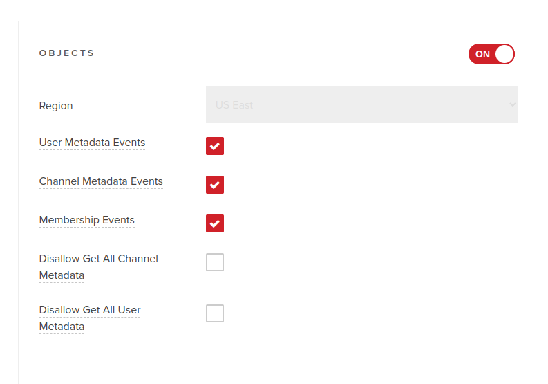

# SDK example project
This project is a sandbox application made to showcase how to use PubNub with the [Seald-SDK](https://docs.seald.io/en/sdk/).

The full documentation of the Seald SDK is available [here](https://docs.seald.io/en/sdk/example/).
The one for PubNub SDK [here](https://www.pubnub.com/docs/)

## Setting up the environment
### Seald configuration 
You need to have a developer account for the Seald-SDK. If you do not have one, you may [create a trial account here](https://www.seald.io/create-sdk).

From there, you will need to get the [elements listed on the documentation](https://docs.seald.io/en/sdk/guides/1-quick-start.html#prerequisites):
- `apiURL`: URL for the API server used. In this project, it will be named `API_URL`.
- `keyStorageURL`: URL for the key storage server used. In this project, it will be named `KEY_STORAGE_URL`.
- `appId`: Unique UUID for your application. In this project, it will be named `APP_ID`.
- `validationKeyId` : unique UUID of the validation key. In this project, it will be named `VALIDATION_KEY_ID`.
- `validationKey` : secret validation key corresponding to the validationKeyId used to generate offline license tokens. In this project, it will be named `VALIDATION_KEY`.

### PubNub configuration
You need to have an account for PubNub. If you do not have one, you may [create a trial account here](https://dashboard.pubnub.com/signup).

From there, you will need to get a demo keyset with the following elements:
- Publish Key: in this project, it will be named `PUBNUB_PUB_KEY`.
- Subscribe Key: in this project, it will be named `PUBNUB_SUB_KEY`.
- Secret Key:  in this project, it will be named `PUBNUB_SECRET_KEY`.

Once you've created a key, you need to enable the `OBJECTS` options, and activate `User Metadata Events`, `Channel Metadata Events`, `Membership Events`
This can be done from your key settings in the Admin Portal.



### Creating the settings files
Using the elements retrieved both from Seald & PubNub in the two previous paragraphs, you can proceed to creating the settings files.
#### Frontend

Settings of the frontend must be set in a `./frontend/src/settings.json` file.

There is a `./frontend/src/settings.example.json` file which is a template of the `settings.json` you can copy & paste, you'll need to replace the values with the actual settings.

The following settings must be set:

| Settings               | Description         |
|------------------------|---------------------|
| `SEALD_JWT_SECRET`     | Seald JWT Secret    |
| `SEALD_JWT_SECRET_ID`  | Seald JWT Secret ID |
| `SEALD_APP_ID`         | Seald App ID        |
| `SEALD_API_URL`        | Seald API URL       |
| `SEALD_KEYSTORAGE_URL` | Seald SSKS API URL  |
| `PUBNUB_PUB_KEY`       | PubNub pub key      |
| `PUBNUB_SUB_KEY`       | PubNub sub key      |

#### Backend

Settings of the backend must be set in a `./backend/settings.json` file.

There is a `./backend/settings.example.json` which is a template of the `settings.json` you can copy & paste, you'll need to replace the values with the actual settings.

The following settings must be set:

| Settings         | Description                                       |
|------------------|---------------------------------------------------|
| `HTTPS_ENABLED`  | `true` or  `false` to setup secure session cookie |
| `SESSION_SECRET` | Random string used to secure session cookie       |

In addition, in production, you may want to set the `NODE_ENV` environment variable to `"production"`, to run the
`express` webserver in production mode.

## Starting the project
Once you have [configured the settings files](#creating-the-settings-files), you can start working on the project.

### Development server
To start working on the project, you need to:
- install dependencies;
- start the development servers (which both have a *watch* feature).

On the backend, it opens a server on port `4000`:
```shell
cd backend
npm install
npm start
```

On the frontend, it opens a server on port `3000`:
```shell
cd frontend
npm install
npm start
```

And *voilà*!

## Liability
Seald SAS who wrote this software and article is strictly independent from PubNub
and its affiliates.

Seald SAS shall not be made liable for any claim, damages or
other liability, whether in an action of contract, tort or otherwise arising
from, out of or in connection with the software or the use or other dealings in
the software.
